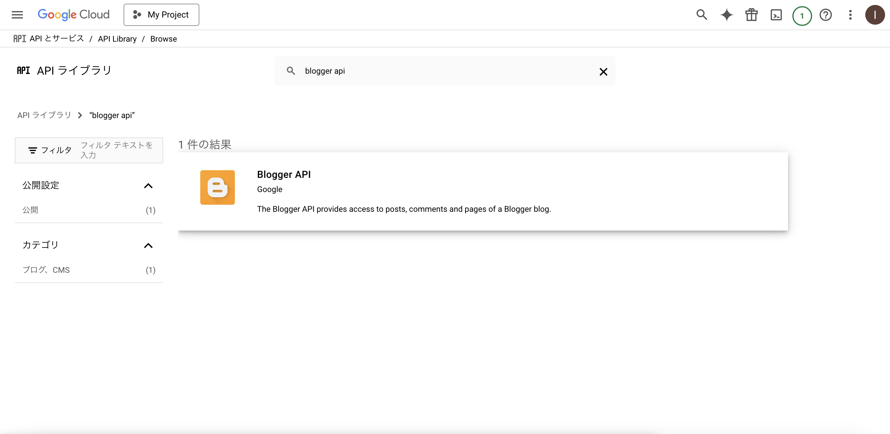
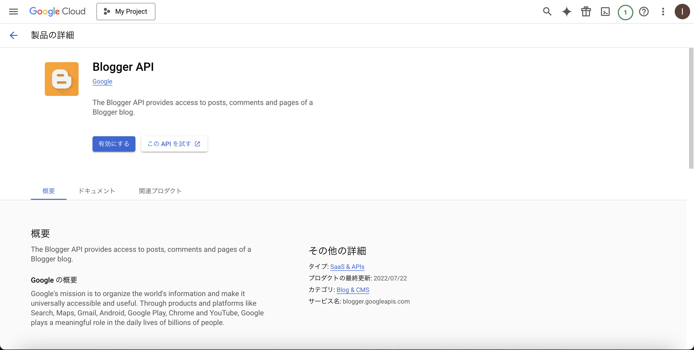
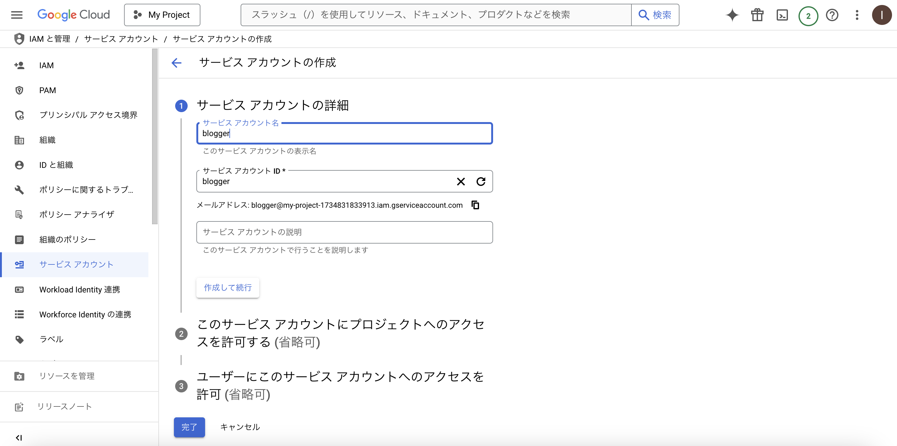
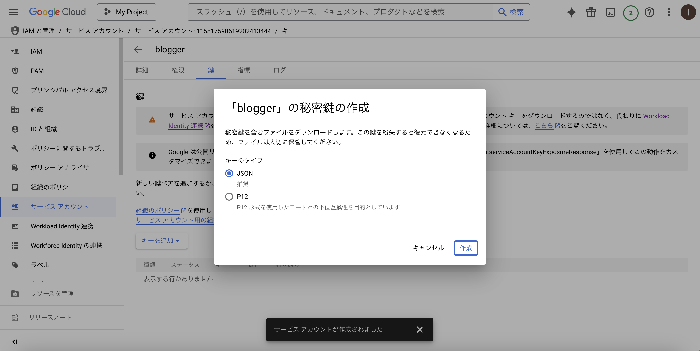
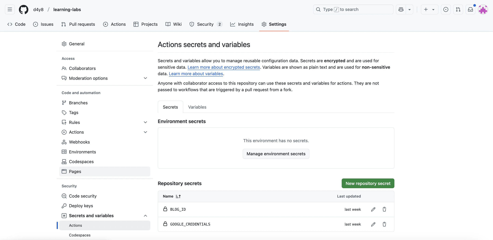

# GitHub ActionsからGoogle Bloggerに完全自動ポストできるか検証する
## 結論から先に
Service Accountで認証する場合、Google Bloggerへポストする権限がなく、完全自動化はできない。

## 自動化しようとした背景
WordPressで運用していたブログをGoogle Bloggerにマイグレーションした際、
移行ツールはあるものの結構手間だった。特に画像の移行。
なので今後ブログサーバーの移行があっても楽できるように
ブログのリソース(記事、画像)はGitHubで管理、ついでに諸々自動化できたらというのが動機。

## やりたいこと
- ブログのリソース(記事や画像)はGitHubで管理したい。
- 記事はMarkdownで書きたい。
- リポジトリにPushしたらGitHub ActionsでBloggerに自動で投稿したい。

## 事前準備
Google Blogger APIを利用するにあたり、認証に必要な設定をしておく。

### Google Cloud設定
Google BloggerのアカウントでGoogle Cloudのプロジェクトは作成済みであることを前提とする。

#### Blogger APIの有効化
作成済みのGoogle Cloudのプロジェクトで、Blogger APIを有効する。
Google Cloud Consoleの[APIとサービス] > [ライブラリ]で[Blogger API]を検索。



有効にする。



#### Service Accountの作成
GitHub ActionsからBlogger APIにアクセスするために、サービスアカウントを作成。

Google Cloud Consoleの[IAMと管理] > [サービスアカウント]で、新しいサービスアカウントを作成。



#### キーの作成

サービスアカウントの認証に使用するJSON形式のキーを作成。
Google Cloud Consoleのサービスアカウントの詳細ページで、[鍵]タブを選択し、
[キーを追加] > [新しい鍵を作成]を選択。キーのタイプは[JSON]を選択し[作成]。
キーファイルがダウンロードされる。



### GitHubリポジトリへのシークレット登録
作成したサービスアカウントキーの内容を、GitHubリポジトリのシークレットとして登録。
リポジトリの[Settings] > [Secrets and variables] > [Actions]で、[New repository secret]押下し、
[Name]と[Secret]（サービスアカウントキーファイルの内容）を入力して保存。



## GitHub Actionsのワークフロー作成

### ざっくりとしたフロー
1. mainブランチへのプッシュで起動
1. Gitリポジトリをcheckout
1. commitしたmdをhtmlへ変換
1. Google Cloud認証
1. htmlをGoogle BloggerへPost

### md -> html変換
以下を利用する。
- [pandoc](https://pandoc-doc-ja.readthedocs.io/ja/latest/users-guide.html)
- [pandoc-include](https://github.com/DCsunset/pandoc-include)

### GitHub Actions から Google Cloud への認証
[google-github-actions/auth](https://github.com/google-github-actions/auth?tab=readme-ov-file#service-account-key-json)でService Account Key Jsonでの認証を利用する。

### 実装内容
.github/workflows/insert-post-to-google-blogger.yaml
```yaml
!include .github/workflows/insert-post-to-google-blogger.yaml
```

.github/scripts/blog_post.py
```py
!include .github/scripts/blog_post.py
```

### GitHub Actionsが実行 -> Bloggerへの投稿時に403エラー

```log
<HttpError 403 when requesting https://blogger.googleapis.com/v3/blogs/***/posts?alt=json returned "We're sorry, but you don't have permission to access this resource.". Details: "[***'message': "We're sorry, but you don't have permission to access this resource.", 'domain': 'global', 'reason': 'forbidden'***]">
```
#### 原因
Service AccountではGoogle Bloggerに記事を投稿する権限はない。

#### 対策(検討)
なし、、、HTMLファイルをリポジトリに保存して、それをGoogle Bloggerに手動更新する。

### 今後やれたら
Textlint、Google Search Console、SNSポスト辺りも自動化できたら良い。

## Troubleshooting
その他、発生したエラーと対処。

### git diff 実行時にエラー
GitHub Actionsのジョブにて以下のように`git diff`したところエラーとなった。
```sh
git diff --name-only ${{ github.event.before }}..HEAD)
```
```log
fatal: Invalid revision range ef1dd6de85606d4627addee932fd51ba7bff9e7d..HEAD
Error: Process completed with exit code 128.
```
#### 原因
actions/checkoutの`fetch-depth`のデフォルトは`1`で、
その場合、最新の履歴のみフェッチされ一つ前の履歴はfetchされていないから。

https://github.com/actions/checkout?tab=readme-ov-file#usage

#### 解決方法
`fetch-depth`を`2`に変更

### GitHub Actionsのジョブでgit pushすると403エラー
```log
remote: Permission to d4y8/learning-labs.git denied to github-actions[bot].
fatal: unable to access 'https://github.com/d4y8/learning-labs/': The requested URL returned error: 403
```
#### 原因
ジョブがコンテンツへの書き込み権限を持っていないため。

#### 解決方法
ジョブに書き込み権限を付与する。
```yaml
jobs:
  call-blogger-api:
    runs-on: ubuntu-latest
    permissions:
      contents: 'write' #追加
```

リポジトリ内のすべてのワークフローに共通して設定する場合は以下でもOK。  

[Settings] > [Actions] > [General] > [Workflow permissions]で
`Read and write permissions`を選択して[Save]。

