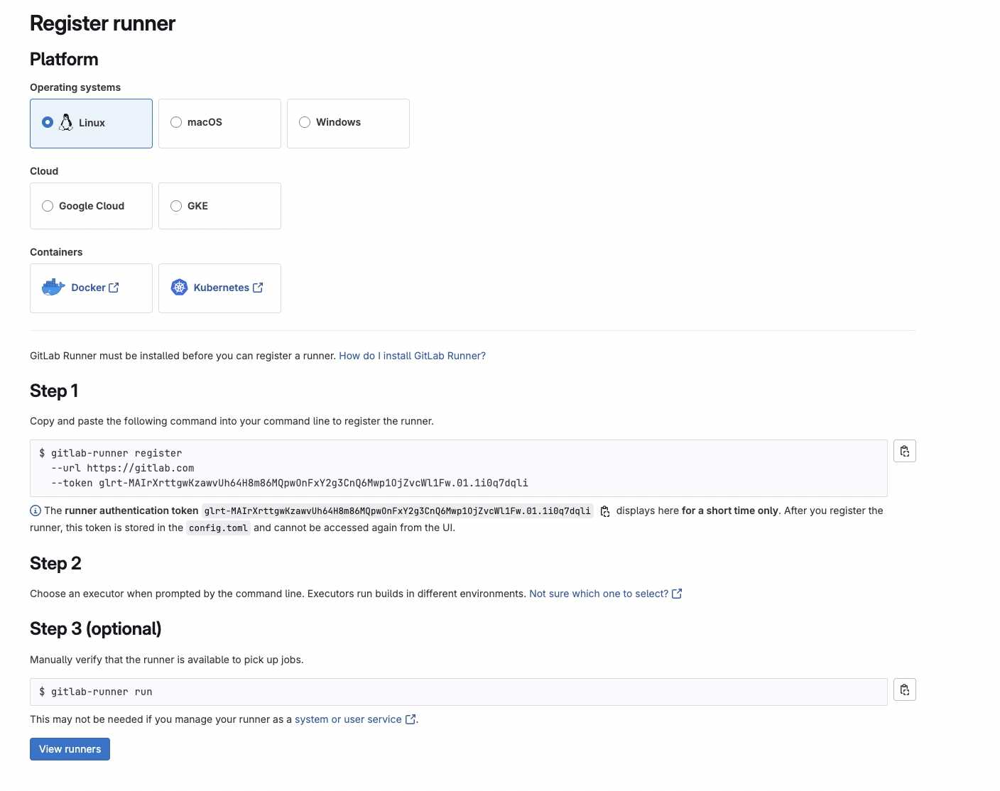

# GitLabからローカルに構築したGitLab Runnerを実行する
SaaSのGitLabのShared Runnerを使おうとしたところ、Credit Cardの登録をしないと使えないようだった。
```log
Credit card required to be on file in order to create a pipeline
```


なのでGitLab Runnerをローカルのminikubeに構築し、Project Runnerに割り当てて利用してみた。

## GitLab Runnerの構築
minikubeに構築する。

```sh
$ kubectl create ns gitlab-runner
$ kubectl -n gitlab-runner create deploy gitlab-runner --image gitlab/gitlab-runner:latest
$ kubectl -n gitlab-runner apply -f role.yaml
$ kubectl -n gitlab-runner get pod

NAME                             READY   STATUS    RESTARTS   AGE
gitlab-runner-785c445c6c-bpwxb   1/1     Running   0          41s
```

## ローカルGitLab RUnnerをProject Runnerとして紐付ける
GitLabのWebUIで[Settings] > [CI/CD] を選択。
[Runners]から[Create Project Runner]を押下。


[Tags]のみ入力し、[Create Runner]を押下してRunnerを作成。


Stepの手順通りに進め、ローカル環境に構築したGitLab Runnerと紐付ける。


```sh
# シェルを取得
$ kubectl -n gitlab-runner exec -it deploy/gitlab-runner -- bash
```
```sh
# RunnerとGitLabの紐付けを対話形式で実行。ExecutorはKubernetes。
$ gitlab-runner register  --url https://gitlab.com  --token glrt-buJ2X4c2CRTGJ608Cazo8W86MQpwOnFxY2g3CnQ6Mwp1OjZvcWl1Fw.01.1i1sr9dgz

Runtime platform                                    arch=arm64 os=linux pid=66 revision=cc489270 version=18.2.1
Running in system-mode.                            
                                                   
Enter the GitLab instance URL (for example, https://gitlab.com/):
[https://gitlab.com]: https://gitlab.com
Verifying runner... is valid                        correlation_id=6b84fc318565600daf7649f9cb52841b runner=KIKqUm4ga
Enter a name for the runner. This is stored only in the local config.toml file:
[gitlab-runner-785c445c6c-bpwxb]: sample
Enter an executor: docker, instance, virtualbox, docker-windows, docker+machine, kubernetes, docker-autoscaler, custom, shell, ssh, parallels:
kubernetes
Runner registered successfully. Feel free to start it, but if it's running already the config should be automatically reloaded!
 
Configuration (with the authentication token) was saved in "/etc/gitlab-runner/config.toml" 
```

```sh
# 正常に登録できていることを確認
$ gitlab-runner list
Runtime platform                                    arch=arm64 os=linux pid=80 revision=cc489270 version=18.2.1
Listing configured runners                          ConfigFile=/etc/gitlab-runner/config.toml
sample                                              Executor=kubernetes Token=glrt-buJ2X4c2CRTGJ608Cazo8W86MQpwOnFxY2g3CnQ6Mwp1OjZvcWl1Fw.01.1i1sr9dgz URL=https://gitlab.com
```
WebUIでも正しく割り当てられていること(緑丸マーク)が確認できる。


## .gitlab-ci.ymlの内容
シンプルにメッセージを出力するだけ。  
[tags]に作成したProject RunnerのTagを設定する。

```yaml
stages:
  - build

build-code-job:
  stage: build
  image: busybox:latest
  tags:
    - sample
  script:
    - echo "GitLab Runner Test"
```

## Pipelineの作成、Jobの実行
[Build] > [Pipelines] > [New Pipeline]を押下。  
[Run new pipeline]のページに必要な情報を入力して[New Pipeline]を押下して作成。Jobが実行される。


## 構築、実行時のTrouble Shoot

### ジョブ実行時エラー
```log
ERROR: Preparation failed: check defaults error: no image specified and no default set in config
```


#### 対処: .gitlab-ci.ymlにimageの定義を追加

```yaml
build-code-job:
  image: busybox:latest
```

### Secretが作成できない旨のエラー
```log
ERROR: Error cleaning up secrets: resource name may not be empty
ERROR: Job failed (system failure): prepare environment: setting up credentials: secrets is forbidden: User "system:serviceaccount:gitlab-runner:default" cannot create resource "secrets" in API group "" in the namespace "default". Check https://docs.gitlab.com/runner/shells/#shell-profile-loading for more information
```


#### Service Accountの権限不足。
[公式ドキュメント](https://docs.gitlab.com/runner/executors/kubernetes/#configure-runner-api-permissions)を参考にRole,Rolebindingのリソースを作成。

```sh
kubectl -n gitlab-runner apply -f role.yaml
```

### Helperのイメージのpullに失敗する
```log
ERROR: Job failed: prepare environment: waiting for pod running: pulling image "registry.gitlab.com/gitlab-org/gitlab-runner/gitlab-runner-helper:x86_64-v18.2.1" for container init-permissions: image pull failed: no matching manifest for linux/arm64/v8 in the manifest list entries. Check https://docs.gitlab.com/runner/shells/#shell-profile-loading for more information
```

#### config.tomlにHelperのイメージを設定
[公式ドキュメント](https://docs.gitlab.com/runner/configuration/advanced-configuration/#helper-image-configuration-for-kubernetes-on-arm)を参考にconfig.tomlのHelperのイメージを変更。
```yaml
  [runners.kubernetes]
    helper_image = "registry.gitlab.com/gitlab-org/gitlab-runner/gitlab-runner-helper:arm64-latest"
```
```sh
# config.tomlをコピー
kubectl -n gitlab-runner cp config.toml gitlab-runner-785c445c6c-bpwxb:/etc/gitlab-runner/config.toml
```