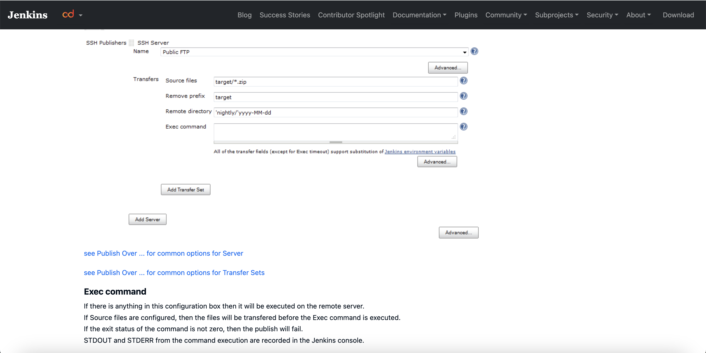

# JenkinsのPluginページの読み方

JenkinsのPluginについて公式ページで使い方を調べていてわかりづらかった点をメモ。

例えば、[Publish Over SSH](https://plugins.jenkins.io/publish-over-ssh/)を例にすると

このページには各Pluginの概要や設定方法と、
**フリースタイルジョブ**でのGUIでの設定方法が記述されている。

Pipelineとしての記述は基本的にこのページではなく、[Links]の[Pipeline Step Reference](https://www.jenkins.io/doc/pipeline/steps/publish-over-ssh/)に記述されている。

フリースタイルとパイプラインのジョブ定義の違いを認識するというのが前提として必要。
