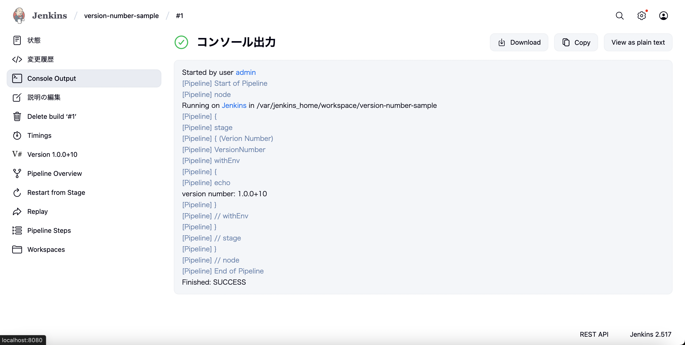
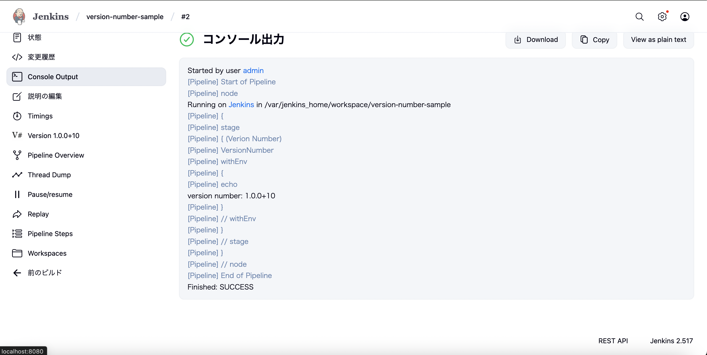
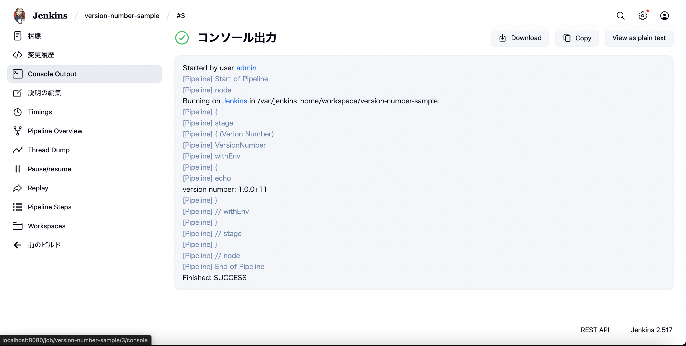

# Jenkins PluginのVersion NumberでoverrideBuildsAllTimeを指定するとインクリメントされない

Jenkins Pluginの Version Numberで[BUILDS_ALL_TIME]を利用する場合、  
`overrideBuildsAllTime`を指定すると番号がインクリメントされない。

通常、[BUILDS_ALL_TIME]は1から始まる。  
これを1ではない数値から始めたい場合、  
例えばパイプラインを作り直した際に続きから再開したいといった場合、   
`overrideBuildsAllTime: 10`などと指定することで実現できる。  

が、これを指定すると次のビルドでも再び`10`と採番されてしまう。

解決策としては一度`overrideBuildsAllTime`を指定して実行したら、  
次回以降は`overrideBuildsAllTime`を削除してしまえば良い。

## 参考 - Version Number Plugin
- https://plugins.jenkins.io/versionnumber/
- https://www.jenkins.io/doc/pipeline/steps/versionnumber/

## Version Number Pluginバージョン
- 234.v315d3b_3cb_fb_5

## パイプラインの検証

Pipelineの定義
```jenkinsfile
!include jenkins/plugin-versionnumber/Jenkinsfile
```

`overrideBuildsAllTime: 10`を指定して実行。  
意図通り10と採番される。



もう一度ビルド実行する。

すると、インクリメントされず前回と同じ番号となる。



回避策としてoverrideBuildsAllTimeを削除し、ビルド実行する。

```jenkinsfile
VERION_NUMBER = VersionNumber(versionNumberString: '1.0.0+${BUILDS_ALL_TIME}')
```



続きの11にインクリメントされることが確認できた。
