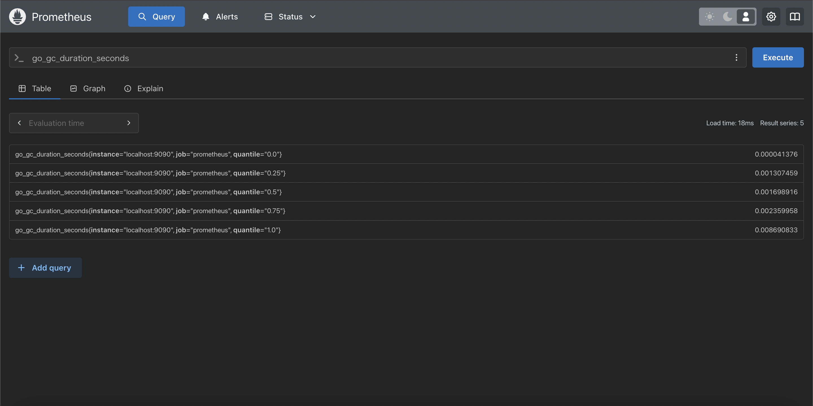

# Prometheusをさわってみる
Prometheusをチュートリアルに沿って簡単にさわってみる。

## チュートリアル
- https://prometheus.io/docs/tutorials/getting_started/
- https://prometheus.io/docs/prometheus/latest/getting_started/

## Prometheusの起動
### 参考 
https://prometheus.io/docs/prometheus/latest/installation/

### DockerでPrometheusを起動する
デフォルトでそのまま起動。
```sh
docker run -p 9090:9090 prom/prometheus
open http://localhost:9090
```
デフォルトの設定はprometheus.ymlで確認できる。
```sh
docker exec <CONTAINER_ID> cat /etc/prometheus/prometheus.yml
```

### Prometheus自身のメトリクスをブラウザで確認
```sh
open http://localhost:9090/metrics
```
出力されるメトリクスは[`metrics.log`](https://github.com/d4y8/learning-labs/blob/main/prometheus/metrics.log)参照

### 収集したMetricsをPrometheusで確認
デフォルトの設定で起動すると、Prometheus自身のメトリクスを収集するように設定されているため
収集したメトリクスをPrometheusで確認してみる。

[Query画面]でメトリクス名を入力して[Execute]ボタンを押下する。  
出力形式は[Table]か[Graph]を選択できる。以下は[Talbe]で表示した例。

  

クエリ(PromQL)の詳細については[公式ドキュメント](https://prometheus.io/docs/prometheus/latest/querying/basics/)を参照。

## PrometheusがスクレイピングするTargetを追加
Prometheus以外のメトリクス収集対象を追加してみる。

### メトリクスをNodeモジュールから収集する
チュートリアルのNodeモジュールをDockerで実行しようとすると
下記のエラーとなり起動できない。
```sh
docker run --rm \
  --net="host" \
  --pid="host" \
  -v "/:/host:ro,rslave" \
  quay.io/prometheus/node-exporter:latest \
  --path.rootfs=/host
```
```log
docker: Error response from daemon: path / is mounted on / but it is not a shared or slave mount.
```

#### 原因：node-exporterのイメージはLinux用でMacOSに対応していない。
#### 回避：node-exporterのバイナリをローカルで起動する。
[Node Exporterのダウンロード](https://prometheus.io/download/#node_exporter)

```sh
cd ./node_exporter-1.8.2.darwin-amd64
./node_exporter
```
```
open http://localhost:9100/metrics
```
#### 収集対象に追加する
prometheus.ymlに追加する。
```yaml
- job_name: node
  static_configs:
  - targets: 
    # - localhost:9100 NG
    - host.docker.internal:9100 # コンテナからホストのサービスへの通信のためlocalhostではなく、host.docker.internal
```

#### Prometheus再起動
```sh
cd ..
docker run --rm -d \
    -p 9090:9090 \
    -v $(pwd)/config:/etc/prometheus \
    prom/prometheus
```
#### 収集できているか確認
```sh
open http://localhost:9090
```
Node Exporterで確認したメトリクス名を入力
```
node_memory_total_bytes
```


#### Scraperが正しく動いているか確認
[Status] > [\[Targets\]](http://localhost:9090/targets)にてStateが`UP`であるか確認する。


## メトリクスの理解
メトリクスの種類については以下参照。  
https://prometheus.io/docs/tutorials/understanding_metric_types/

## その他 - docker実行時のバインドについて
```sh
# 設定ファイルをバインド
docker run --rm -d \
    -p 9090:9090 \
    -v $(pwd)/config/prometheus.yml:/etc/prometheus/prometheus.yml \
    prom/prometheus

# ディレクトリをバインドする場合
docker run --rm -d \
    -p 9090:9090 \
    -v $(pwd)/config:/etc/prometheus \
    prom/prometheus
```
