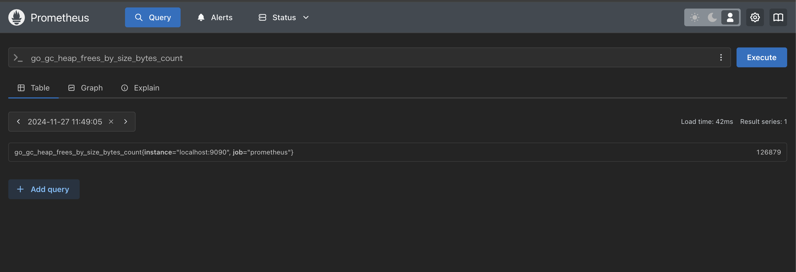

# Prometheus

## チュートリアル
https://prometheus.io/docs/tutorials/getting_started/
https://prometheus.io/docs/prometheus/latest/getting_started/

## Prometheusを起動する
### 参考 
https://prometheus.io/docs/prometheus/latest/installation/

### DockerでPrometheusを起動する
```sh
docker run -p 9090:9090 prom/prometheus
open http://localhost:9090
```
### MetircsをScrapingする対象を設定して起動
Prometheus自身からメトリクスを収集してみる

設定ファイルprometheus.ymlは以下に配置する。

`/etc/prometheus/prometheus.yml`

```sh
# 設定ファイルをバインド
docker run --rm -d \
    -p 9090:9090 \
    -v $(pwd)/config/prometheus.yml:/etc/prometheus/prometheus.yml \
    prom/prometheus

# ディレクトリをバインド
# ディレクトリ指定の場合、HOST側は相対パスでOK -> 誤り。デフォルトのprometheus.ymlが配置される。
# docker run --rm -d \
#     -p 9090:9090 \
#     -v config:/etc/prometheus \
#     prom/prometheus

# こちらはOK
docker run --rm -d \
    -p 9090:9090 \
    -v $(pwd)/config:/etc/prometheus \
    prom/prometheus
```
設定ファイルが正しく配置されているか確認
```sh
docker exec <CONTAINER_ID> cat /etc/prometheus/prometheus.yml
```

### prometheusのメトリクスをブラウザで確認
```sh
open http://localhost:9090/metrics
```
メトリクスの形式は`metrics.log`参照

### 収集したMetricsをGraphで確認
[Graph](http://localhost:9090/graph?g0.expr=&g0.tab=1&g0.display_mode=lines&g0.show_exemplars=0&g0.range_input=1h)でメトリクス名を入力して[Execute]ボタンを押下する。
  

クエリ(PromQL)の詳細については[公式ドキュメント](https://prometheus.io/docs/prometheus/latest/querying/basics/)を参照。

## PrometheusがScrapingするtargetを追加
Prometheus以外のメトリクス収集対象を追加してみる。

### メトリクスをNodeモジュールから収集する
下記のエラーとなり起動できない。
```sh
docker run --rm \
  --net="host" \
  --pid="host" \
  -v "/:/host:ro,rslave" \
  quay.io/prometheus/node-exporter:latest \
  --path.rootfs=/host
```
```log
docker: Error response from daemon: path / is mounted on / but it is not a shared or slave mount.
```
```sh
mount --make-rshared /
sudo mount --make-rprivate /
```

#### 原因：node-exporterのイメージはMacOSに対応していない。Linux用。
#### 回避：エクスポーターをホストで稼働する
Node Exporterのダウンロード
https://prometheus.io/download/#node_exporter

```sh
cd ./node_exporter-1.8.2.darwin-amd64
./node_exporter
```
```
curl -vs http://localhost:9100/metrics
```
#### 収集対象に追加する
```yaml
- job_name: node
  static_configs:
  - targets: 
    # - localhost:9100 NG
    - host.docker.internal:9100 # コンテナからホストのサービスへの通信のためlocalhostではなく、host.docker.internal
```
#### Prometheus再起動
```sh
cd ..
docker run --rm -d \
    -p 9090:9090 \
    -v $(pwd)/config:/etc/prometheus \
    prom/prometheus
```
#### 収集できているか確認
```sh
open http://localhost:9090/graph
```
```
node_memory_total_bytes
```


#### Scraperが正しく動いているか確認
[Status] > [\[Targets\]](http://localhost:9090/targets)にてStateが`UP`であるか確認する。


## メトリクスの理解
https://prometheus.io/docs/tutorials/understanding_metric_types/
